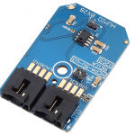

# HumiChip (HCPA-5V-U3)

This library provides a class for the HumiChip, it relies on the ncd-red-comm library for communication, and includes a node-red node for the HCPA-5V-U3. The HumiChip is a capacitive polymer sensor, these chips are individually calibrated and tested, and provide high accuracy temperature and humidity readings at a low cost. [Ncd.io](https://ncd.io) manufactures a mini-module using this chip, allowing you to get started with no need for soldering. You can buy it [here](https://store.ncd.io/product/hcpa-5v-u3-humidity-and-temperature-sensor-%C2%B12rh-%C2%B10-3c-i2c-mini-module/).

[](https://store.ncd.io/product/hcpa-5v-u3-humidity-and-temperature-sensor-%C2%B12rh-%C2%B10-3c-i2c-mini-module/)

### Installation

This library can be installed with npm with the following command:

```
npm install ncd-red-humichip
```

For use in node-red, use the same command, but inside of your node-red directory (usually `~./node-red`).

### Usage

The `test.js` file included in this library contains a basic example for use.  All of the available configurations are available in the node-red node through the UI.

### Raspberry Pi Notes

If you intend to use this on the Raspberry Pi, you must ensure that:
1. I2C is enabled (there are plenty of tutorials on this that differ based on the Pi version.)
2. Node, NPM, and Node-red should be updated to the LTS versions. If you skip this step the ncd-red-comm dependency may not load properly.
